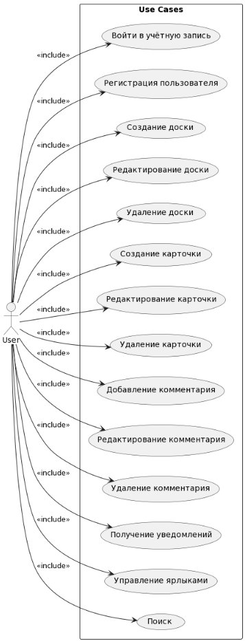

# Диаграмма вариантов использования

---

## Варианты использования

---

## 2.1 Войти в учётную запись

**Описание:** Вариант использования "Войти в учётную запись" позволяет пользователю войти в учётную запись.

**Предусловия:** Пользователь ранее создал учётную запись в приложении TaskManager.

**Основной поток:**
1. Пользователь вводит имя пользователя и пароль в окне входа в учётную запись TaskManager.
2. Система проверяет правильность введенных данных.
3. Если данные верны, система авторизует пользователя.
4. Система отображает главное окно приложения TaskManager.

## 2.2 Регистрация пользователя

**Описание:** Вариант использования "Регистрация пользователя" позволяет пользователю создать новую учётную запись в приложении TaskManager.

**Предусловия:** Пользователь ранее не создал учётную запись в приложении TaskManager.

**Основной поток:**
1. Пользователь вводит имя пользователя, адрес электронной почты и пароль в окне регистрации TaskManager.
2. Система проверяет уникальность имени пользователя.
3. Если имя пользователя уникально, система создает новую учётную запись.
4. Система авторизует пользователя и отображает главное окно приложения TaskManager.
5. Система отправляет подтверждение регистрации на адрес электронной почты пользователя.

## 2.3 Создание доски

**Описание:** Вариант использования "Создание доски" позволяет пользователю создать новую доску в приложении TaskManager.

**Предусловия:** Пользователь вошёл в учётную запись TaskManager.

**Основной поток:**
1. Пользователь выбирает опцию создания новой доски в главном окне приложения TaskManager.
2. Система отображает форму создания новой доски.
3. Пользователь вводит название доски, выбирает параметры скрытости и добавляет участников.
4. Система создает новую доску с указанными параметрами.
5. Система отображает созданную доску в главном окне приложения TaskManager.

