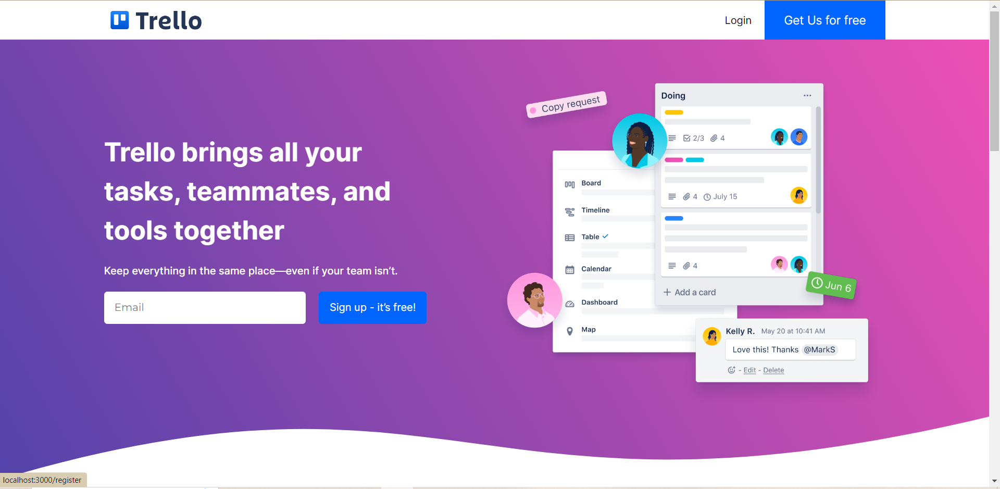
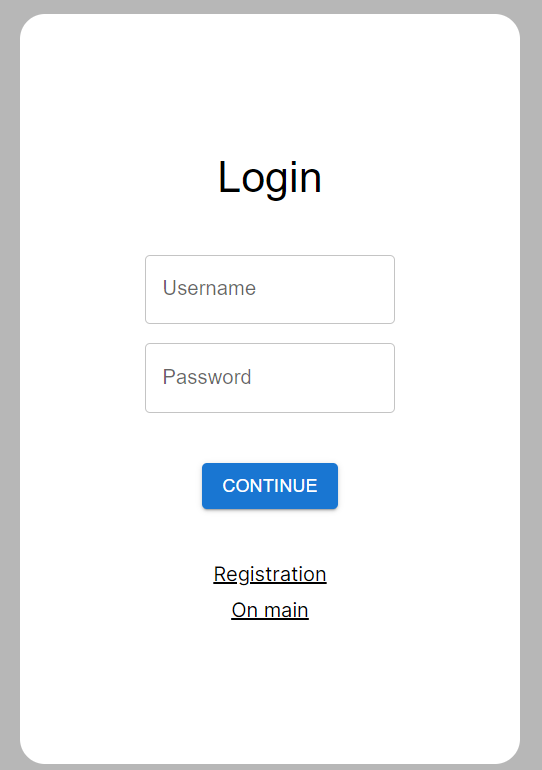
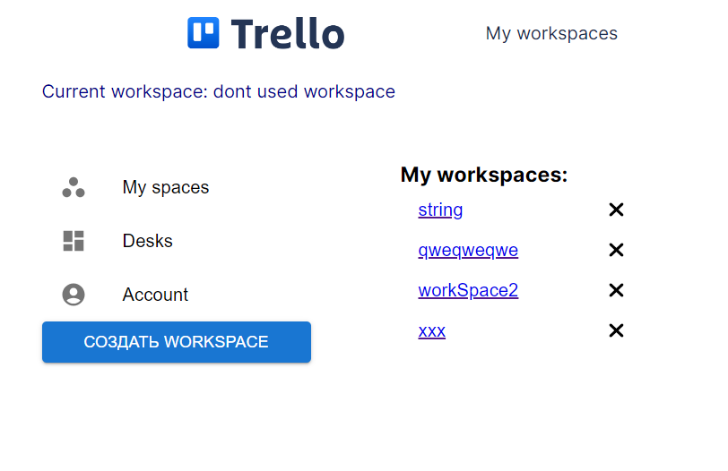
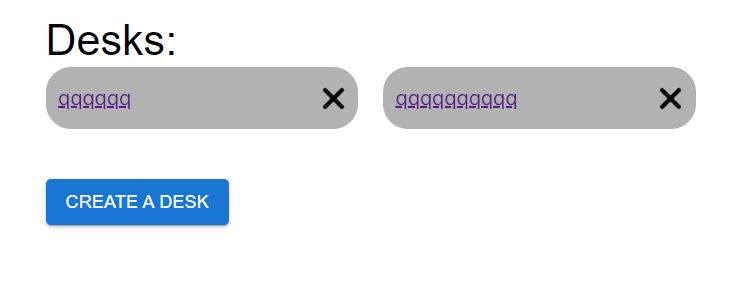
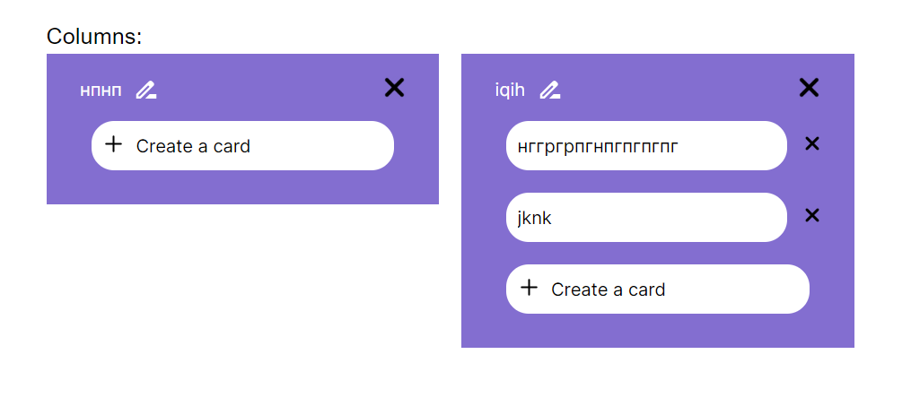

## Требования к проекту
---

### 1 Описание проекта
Проект **"Диспетчер задач для команды"** представляет собой web-приложение, которое предоставляет возможность команде управлять задачами, распределять работу и отслеживать выполнение задач. Пользователи получат возможность для создания задач, отслеживания статуса их выполнения, авторизации пользователя. 

### 2 Требования пользователя

#### 2.1 Программные интерфейсы
Интерфейс диспетчера задач должен быть простым и интуитивно понятным для пользователей. При разработке программного продукта используются:

**Frontend:**

JavaScript библиотека: **React**

Языки разметки и стилизации: **HTML, CSS**

Клиентская часть будет реализовывать функционал backend приложения посредством вызова API методов. Приложение может быть запущено в любом браузере на любой системе. Использование HTML и CSS позволит создать красивый и интуитивно понятный дизайн для пользователей.

#### 2.2 Интерфейс пользователя

Пользовательский интерфейс будет представлен в виде веб-страниц с интуитивно понятным навигационным меню. У пользователей будет возможность создания рабочего пространства, создание доски на рабочем пространстве и колонки на каждой доске. Также будет возможность добавления других пользователей в свое рабочее пространство.

### Мокап того, как будет выглядеть интерфейс проека:

### **Главная страница**

### **Форма авторизации**

### **Выбор рабочего пространства**

### **Доски на рабочем пространстве**

### **Колонки**

### 3 Системные требования

Для использования приложения необходим один из перечисленных браузеров:
- Chrome
- Firefox
- Internet Explorer версия 10+
- Microsoft Edge
- Opera
  
#### 3.1 Функциональные требования

Система должна обеспечивать возможность выполнения следующих функций:
- создание задач и назначение их участникам команды;
- отслеживание статуса выполнения задач;
- подробные отчеты о задачах и выполнении работ;
- аутентификация и авторизация пользователей.

#### 3.2 Нефункциональные требования

- приложение должно иметь дружественный дизайн;
- навигация по приложению должна быть простой, интерфейс должен быть интуитивно понятным для всех пользователей, независимо от их технической грамотности.

### 4 Исходный код проекта

- [Frontend](https://github.com/kattymwk/TaskManager)
- [Backend](https://github.com/Maketfay/TaskManager)
- [Скрипт создания базы данных](https://github.com/Maketfay/TaskManager)
